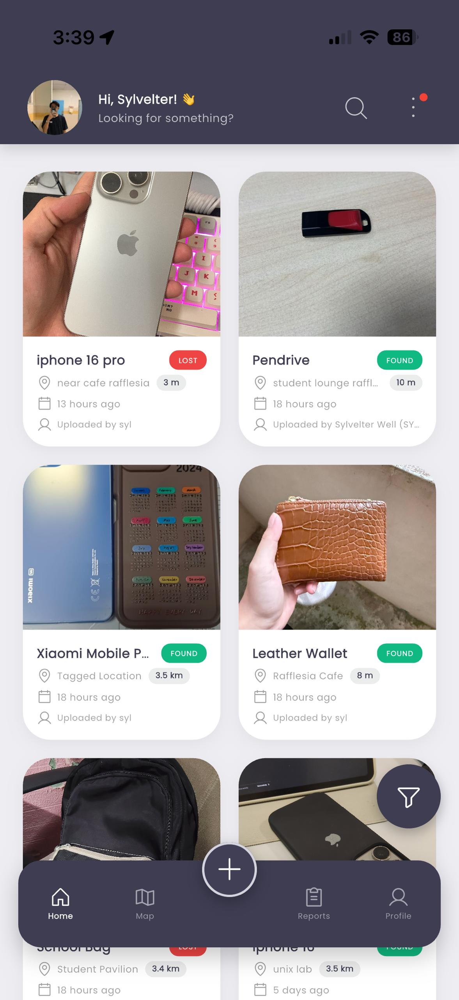
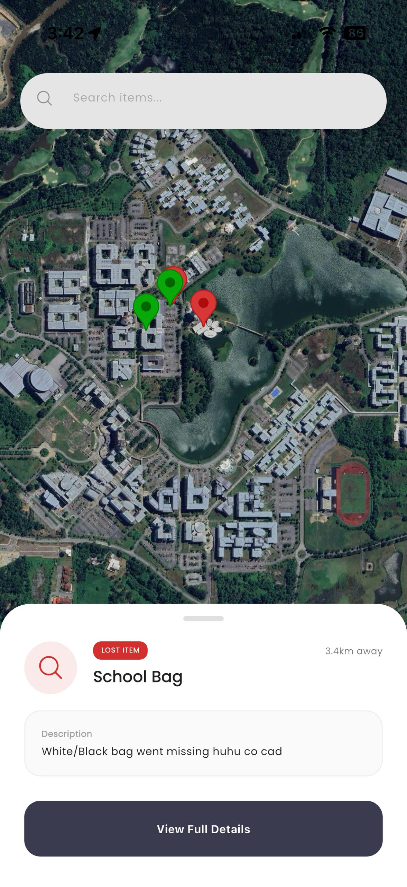
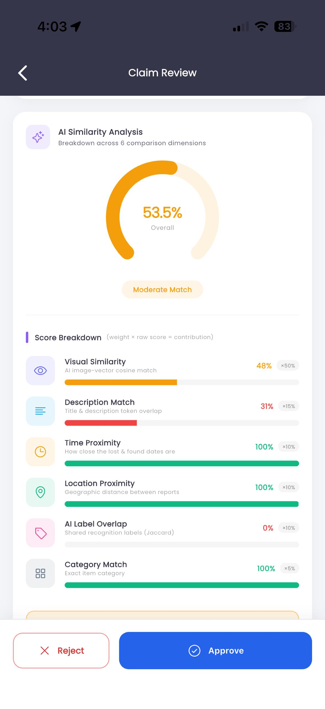
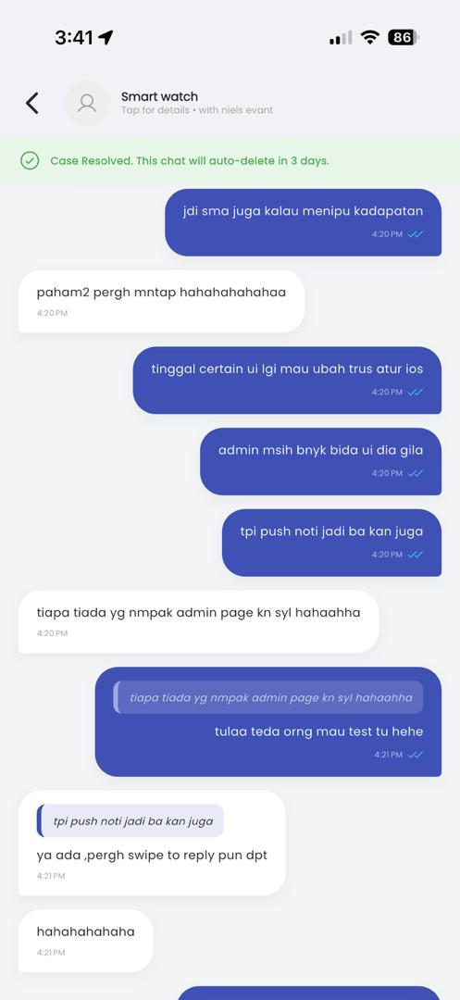

<div align="center">
   
</div>

# FoundIT

Reuniting people with what matters most.

FoundIT is an intelligent mobile ecosystem designed specifically to bridge the gap between lost items and their owners within university and local community environments. By combining Real-time Geospatial Mapping, advanced AI Similarity Scoring, and Secure Lifecycle Messaging, we provide a reliable, moderated, and seamless recovery experience.

## Screenshots

<div align="center">
  
  
  
  
</div>

## Core Innovation

###  Advanced AI & Image Processing
FoundIT integrates specialized AI models to streamline reporting and prevent fraudulent claims.
- **Smart Categorization**: Uploaded images are analyzed to suggest item categories (e.g., "Electronics", "Wallet", "Keys"), dramatically speeding up the reporting process.
- **AI Similarity Scoring**: When a finder submits an "I Found This Item!" claim, the system runs a similarity comparison between the newly uploaded proof picture and the originally reported lost item image, assisting Admins in verification.

###  Intelligent Geospatial Mapping
- **Proximity Filtering**: Maps and dashboards automatically filter items based on a localized 10km radius from the user's current location, keeping search results highly relevant.
- **Dynamic Exploration**: Pull-to-refresh mechanics and category filtering provide a real-time, interactive exploration of the geographical area.

## Key Features

- **Robust Authentication**: Supports Google SSO, standard Email/Password, and requires Student Matric Numbers to maintain a trusted campus/community environment.
- **Role-Based Admin Dashboard**: Dedicated administrative view to verify "Found Tips", process claims, and ensure platform safety before unlocking communication between users.
- **Secure Chat Lifecycles**: Approved claims generate direct chat rooms. These chats enforce multi-party resolution (both users must mark as resolved) and feature a strict 3-day retention policy after completion.
- **Unified Error Handling**: Comprehensive standardized error logging and user-friendly Snackbar displays across all workflows to ensure app stability.

## Tech Stack

| Category | Technology |
| --- | --- |
| **Frontend** | Flutter, Google Fonts, Flutter Spinkit |
| **Backend** | Firebase (Auth, Firestore, Storage) |
| **Intelligence** | TensorFlow Lite (MobileNetV3) |
| **Architecture** | Feature-Driven Modular Architecture |
| **Maps & Location** | Google Maps API, GeoLocator & GeoFlutterFire+ |

## Project Architecture

We follow a Feature-Driven Modular Architecture for maximum scalability.

```text
lib/
├── core/               # Global constants, themes, and shared utilities (e.g., AppErrorHandler)
├── features/           # UI-centric slices of the app
│   ├── auth/           # Onboarding, Registration & Authentication
│   ├── map/            # Geospatial discovery, clustering & Map logic
│   ├── chat/           # Secure messaging system and resolution lifecycle
│   ├── profile/        # User settings, reports, and claims tracking
│   └── report_item/    # AI-supported forms & submissions
├── models/             # Type-safe data structures
├── services/           # The "Engine Room" (API & Logic)
│   ├── ai_service.dart       # AI Orchestration & Similarity Scoring
│   ├── location_service.dart # Geospatial metric calculations
│   └── database_service.dart # Firestore transactions
└── widgets/            # Reusable UI components & shimmers
```

## Installation & Setup

### Prerequisites

- Flutter SDK (^3.10.0)
- A Firebase Project with Firestore and Storage enabled.
- A Google Maps API Key.

### Steps

**1. Clone the Repo**

```bash
git clone https://github.com/SYLLINEX/FoundIT.git
cd found_it
```

**2. Install Dependencies**

```bash
flutter pub get
```

**3. Configure Firebase**

- Add your `google-services.json` (Android) and `GoogleService-Info.plist` (iOS).
- Run `flutterfire configure`.

**4. Environment Variables**

Create a `.env` file in the root directory:

```env
MAPS_API_KEY=your_key_here
```

**5. Launch**

```bash
flutter run
```

## Contribution

FoundIT is an open-source initiative. If you'd like to improve the AI model or app logic:

1. Fork the Project.
2. Create your Feature Branch (`git checkout -b feature/AmazingFeature`).
3. Commit your Changes (`git commit -m 'Add some AmazingFeature'`).
4. Push to the Branch (`git push origin feature/AmazingFeature`).
5. Open a Pull Request.
